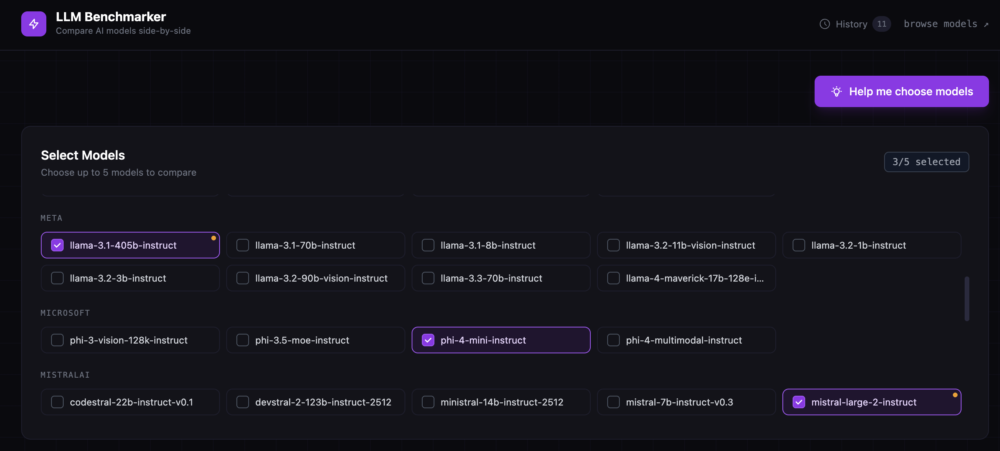
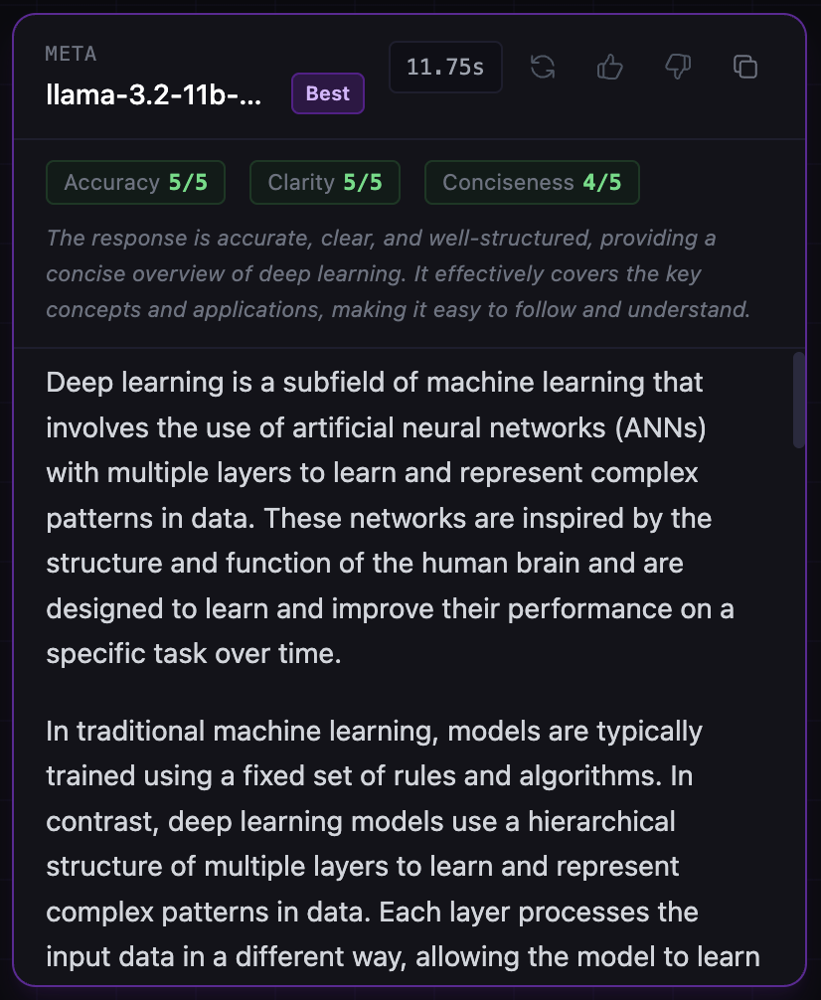

# LLM Benchmarker

An open-source tool for comparing AI model responses side-by-side. Select up to 5 models, enter a prompt, and instantly see responses with latency, token counts, judge scores, and efficiency recommendations. All running locally, no accounts required beyond an NVIDIA API key.

## Screenshots

**Model selector with AI-powered recommendations:**


**Result card with judge scores and Best badge:**


---

## Features

### Core benchmark
- **Streaming responses**: result cards appear immediately and text streams in token-by-token with a live cursor; all models stream in parallel
- **Side-by-side comparison**: run up to 5 models simultaneously
- **Markdown rendering**: responses render with full formatting (headers, code blocks, lists)
- **Latency chart**: color-coded bar chart (green / amber / red) sorted fastest-first; failed models excluded
- **Token usage chart**: completion tokens per model sorted fewest-first, with tokens/sec and an efficiency recommendation when one model uses 25% fewer tokens than average
- **Per-card token counts**: prompt, completion, and total tokens on each result card
- **System prompt toggle**: optionally prepend a system prompt to every model call
- **Temperature and max tokens**: Settings panel in the prompt area exposes a temperature slider (0.0 precise to 1.0 creative) and a max tokens slider (256 to 4096); applied to all model calls including regenerate
- **Model selection persisted**: your last selection is saved to localStorage automatically

### Evaluation
- **LLM-as-judge**: after a benchmark, pick any judge model to score each response 1-5 on accuracy, clarity, and conciseness; includes a one-sentence reasoning note per model
- **Winner highlighting**: the highest-scoring model gets a purple "Best" badge and glowing border
- **Human voting**: thumbs up / thumbs down on each card; toggleable, resets on new run

### Per-card actions
- **Regenerate**: re-run a single model in-place without touching other cards; clears its judge score and vote
- **Copy response**: one-click clipboard copy with confirmation

### History and sharing
- **Run history**: every benchmark is auto-saved to localStorage (capped at 20); a drawer in the header lets you browse, restore, or delete past runs; judge scores are saved when evaluation completes
- **Shareable URLs**: after each run the URL updates with `?p=<prompt>&m=<models>`; open the link and the prompt and model selection are pre-filled automatically; a "Copy link" button appears next to the results header

### Model health
- **Failed model indicators**: models that error in a benchmark get an amber dot and border in the selector; hovering shows the last error message; the flag clears automatically when the model succeeds and expires after 24 hours

### AI-powered model selection
- **Help me choose models**: a prominent CTA button above the model selector opens an inline panel; describe your use case and Claude recommends 4 models from the full available list with a one-sentence reason for each pick and a selection strategy summary; click "Select these models" to auto-fill the selector and run

---

## Prerequisites

- [Docker Desktop](https://www.docker.com/products/docker-desktop/) (includes Docker Compose)
- A free NVIDIA API key. Get one at [build.nvidia.com/models](https://build.nvidia.com/models)
- An Anthropic API key for the model recommender. Get one at [console.anthropic.com](https://console.anthropic.com)

---

## Setup (3 steps)

```bash
# 1. Clone the repository
git clone https://github.com/ArielSmoliar/llm-benchmarker.git
cd llm-benchmarker

# 2. Add your NVIDIA API key
cp .env.example .env
# Edit .env and set both keys:
# NVIDIA_API_KEY=your_nvidia_key_here
# ANTHROPIC_API_KEY=your_anthropic_key_here

# 3. Start the app
docker compose up --build
```

Open **http://localhost:3000** in your browser.

> **First run** takes ~2 minutes to build the Docker images. Subsequent starts are instant.

---

## Usage

1. **Select models**: pick up to 5 from the panel (grouped by provider); models that failed in previous runs show an amber warning dot
2. **Write your prompt**: optionally enable a system prompt via the toggle; click **Settings** to adjust temperature and max tokens
3. **Run Benchmark**: result cards appear immediately and stream token-by-token; latency and token charts update when all models finish
4. **Auto-evaluate**: click **Evaluate** in the panel above the results to score all responses with a judge model
5. **Vote or regenerate**: use thumbs up/down to rate responses, or click the regenerate button on any card to re-run just that model
6. **Share**: click **Copy link** next to the Results header to copy a URL that restores your prompt and model selection
7. **Browse history**: click **History** in the top-right to open past runs; click any entry to restore it

---

## Development (without Docker)

**Backend:**
```bash
cd backend
pip install -r requirements.txt
NVIDIA_API_KEY=your_key uvicorn main:app --reload
```

**Frontend:**
```bash
cd frontend
npm install
npm run dev   # proxies /api/* to http://localhost:8000
```

---

## Tech stack

| Layer | Technology |
|---|---|
| Frontend | React 18, Vite 5, Tailwind CSS 3 |
| Backend | Python FastAPI, httpx (async) |
| Benchmark API | NVIDIA NIM (OpenAI-compatible) |
| Recommender AI | Anthropic SDK (claude-sonnet-4-6) |
| Infra | Docker Compose: nginx serves React, proxies `/api/*` to FastAPI |

---

## Roadmap

- [x] Streaming responses (token-by-token rendering)
- [x] Temperature / max_tokens sliders per run
- [ ] Batch / CSV eval: upload a file of prompts and run them all
- [ ] SQLite persistence for run history

---

## Feedback and contributions

Open an issue at [GitHub Issues](https://github.com/ArielSmoliar/llm-benchmarker/issues).

---

## License

MIT
